# QA Selenium Lab

Projeto de portfólio criado para praticar, organizar e documentar testes automatizados end-to-end com Selenium WebDriver e JavaScript.

O objetivo deste projeto é demonstrar uma suíte de automação web cobrindo fluxos reais de uma aplicação de e-commerce de treino, com validações, evidências e execução completa via terminal.

## Tecnologias utilizadas

- Selenium WebDriver
- JavaScript
- Node.js
- Mocha
- SauceDemo
- Git
- GitHub
- Markdown

## Sistema utilizado para teste

Aplicação: [SauceDemo](https://www.saucedemo.com/)

O SauceDemo é uma aplicação web utilizada para estudos de QA, permitindo praticar fluxos como login, carrinho e checkout.

## Escopo da automação

A suíte automatizada cobre os seguintes fluxos:

- Login com usuário válido;
- Login com usuário inválido;
- Login com usuário bloqueado;
- Adição de produto ao carrinho;
- Validação de produto no carrinho;
- Checkout completo;
- Execução da suíte completa via terminal.

## Estrutura do projeto

```text
qa-selenium-lab
├── docs
│   └── evidencias
│       └── selenium
│           ├── login-valido-teste-passando.png
│           ├── login-valido-saucedemo.png
│           ├── login-invalido-teste-passando.png
│           ├── login-invalido-saucedemo.png
│           ├── login-usuario-bloqueado-teste-passando.png
│           ├── login-usuario-bloqueado-saucedemo.png
│           ├── produto-adicionado-carrinho-teste-passando.png
│           ├── produto-adicionado-carrinho-saucedemo.png
│           ├── validacao-carrinho-teste-passando.png
│           ├── validacao-carrinho-saucedemo.png
│           ├── checkout-completo-teste-passando.png
│           ├── checkout-completo-saucedemo.png
│           └── suite-completa-selenium-passando.png
├── tests
│   ├── saucedemo-login.test.js
│   ├── saucedemo-cart.test.js
│   └── saucedemo-checkout.test.js
├── .gitignore
├── package.json
├── package-lock.json
└── README.md
```

## Como executar o projeto

Instale as dependências, caso necessário:

```bash
npm install
```

Execute toda a suíte de testes:

```bash
npm test
```

Execute um arquivo específico:

```bash
npx mocha tests/saucedemo-login.test.js --timeout 30000
```

```bash
npx mocha tests/saucedemo-cart.test.js --timeout 30000
```

```bash
npx mocha tests/saucedemo-checkout.test.js --timeout 30000
```

## Arquivos de teste

### Login

Arquivo:

```text
tests/saucedemo-login.test.js
```

Cenários cobertos:

- Login válido;
- Login inválido;
- Login com usuário bloqueado.

### Carrinho

Arquivo:

```text
tests/saucedemo-cart.test.js
```

Cenários cobertos:

- Adicionar produto ao carrinho;
- Validar produto, preço e botão de checkout na página do carrinho.

### Checkout

Arquivo:

```text
tests/saucedemo-checkout.test.js
```

Cenário coberto:

- Realizar checkout completo com sucesso.

## Cenários automatizados

### CT-01 - Login válido

**Objetivo:** validar que um usuário com credenciais corretas consegue acessar a página de produtos.

**Dados utilizados:**

| Campo | Valor |
|---|---|
| Usuário | `standard_user` |
| Senha | `secret_sauce` |

**Validações realizadas:**

- Redirecionamento para `/inventory.html`;
- Exibição do título `Products`;
- Exibição da lista de produtos.

**Evidências:**

```text
docs/evidencias/selenium/login-valido-teste-passando.png
docs/evidencias/selenium/login-valido-saucedemo.png
```

### CT-02 - Login inválido

**Objetivo:** validar que o sistema exibe mensagem de erro ao tentar login com credenciais inválidas.

**Dados utilizados:**

| Campo | Valor |
|---|---|
| Usuário | `usuario_invalido` |
| Senha | `senha_invalida` |

**Validações realizadas:**

- Exibição da mensagem de erro;
- Permanência do usuário na tela de login.

**Evidências:**

```text
docs/evidencias/selenium/login-invalido-teste-passando.png
docs/evidencias/selenium/login-invalido-saucedemo.png
```

### CT-03 - Login com usuário bloqueado

**Objetivo:** validar que o sistema bloqueia o acesso de um usuário impedido de realizar login.

**Dados utilizados:**

| Campo | Valor |
|---|---|
| Usuário | `locked_out_user` |
| Senha | `secret_sauce` |

**Validações realizadas:**

- Exibição da mensagem de usuário bloqueado;
- Permanência do usuário na tela de login.

**Evidências:**

```text
docs/evidencias/selenium/login-usuario-bloqueado-teste-passando.png
docs/evidencias/selenium/login-usuario-bloqueado-saucedemo.png
```

### CT-04 - Adicionar produto ao carrinho

**Objetivo:** validar que um produto pode ser adicionado ao carrinho com sucesso.

**Produto utilizado:**

| Produto | Valor |
|---|---|
| Sauce Labs Backpack | `$29.99` |

**Validações realizadas:**

- Clique no botão `Add to cart`;
- Exibição do contador do carrinho com valor `1`;
- Alteração do botão para `Remove`.

**Evidências:**

```text
docs/evidencias/selenium/produto-adicionado-carrinho-teste-passando.png
docs/evidencias/selenium/produto-adicionado-carrinho-saucedemo.png
```

### CT-05 - Validar produto na página do carrinho

**Objetivo:** validar que o produto adicionado aparece corretamente na página do carrinho.

**Validações realizadas:**

- Redirecionamento para `/cart.html`;
- Exibição do título `Your Cart`;
- Exibição do produto `Sauce Labs Backpack`;
- Exibição do preço `$29.99`;
- Exibição do botão `Checkout`.

**Evidências:**

```text
docs/evidencias/selenium/validacao-carrinho-teste-passando.png
docs/evidencias/selenium/validacao-carrinho-saucedemo.png
```

### CT-06 - Checkout completo

**Objetivo:** validar o fluxo completo de compra, desde o carrinho até a finalização do pedido.

**Dados utilizados:**

| Campo | Valor |
|---|---|
| Nome | `Bruno` |
| Sobrenome | `Ramos` |
| CEP | `72000-000` |

**Validações realizadas:**

- Acesso à etapa de informações do checkout;
- Preenchimento dos dados do comprador;
- Acesso à tela de resumo da compra;
- Validação do produto no resumo;
- Validação do preço;
- Finalização da compra;
- Exibição da mensagem `Thank you for your order!`.

**Evidências:**

```text
docs/evidencias/selenium/checkout-completo-teste-passando.png
docs/evidencias/selenium/checkout-completo-saucedemo.png
```

## Resultado da suíte completa

A suíte foi executada via terminal com o comando:

```bash
npm test
```

Resultado obtido:

```text
saucedemo-login.test.js       3 testes passando
saucedemo-cart.test.js        2 testes passando
saucedemo-checkout.test.js    1 teste passando

Total: 6 testes passando
```

**Evidência da execução completa:**

```text
docs/evidencias/selenium/suite-completa-selenium-passando.png
```

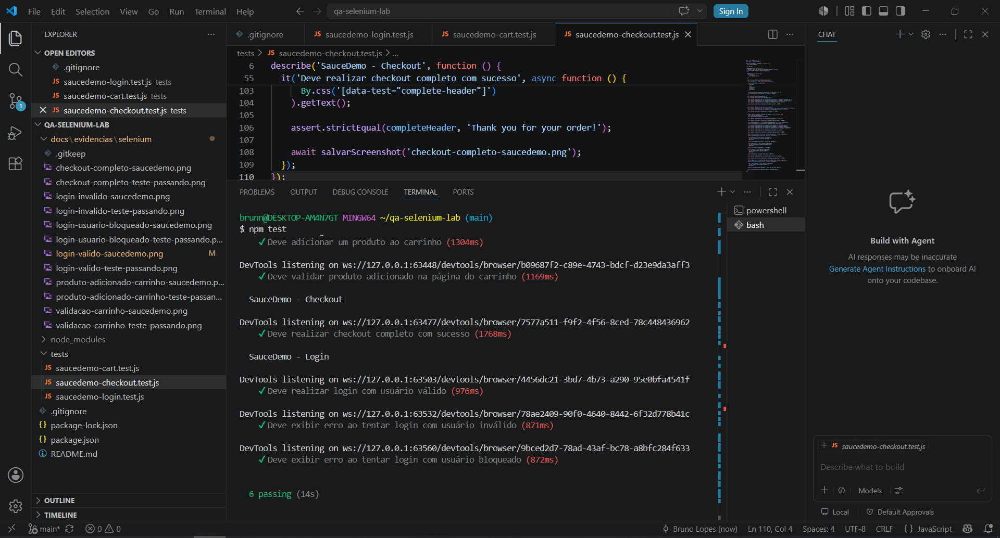

## Evidências visuais

### Login válido

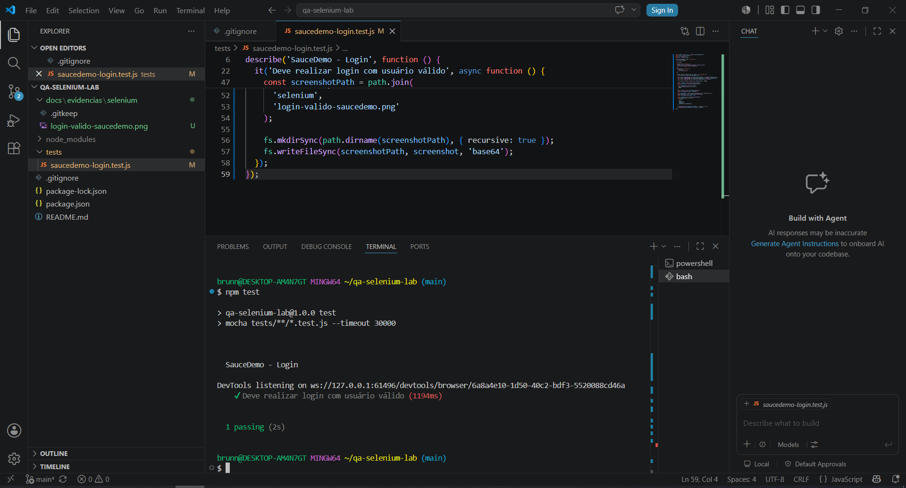

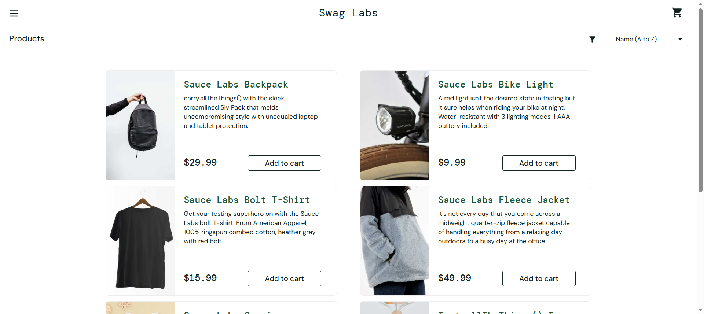

### Login inválido

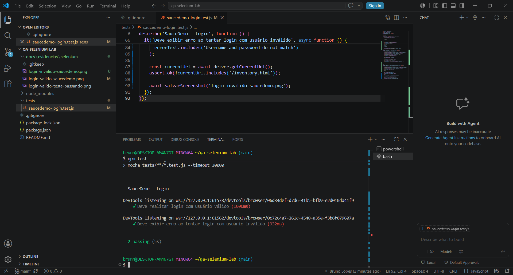


### Usuário bloqueado

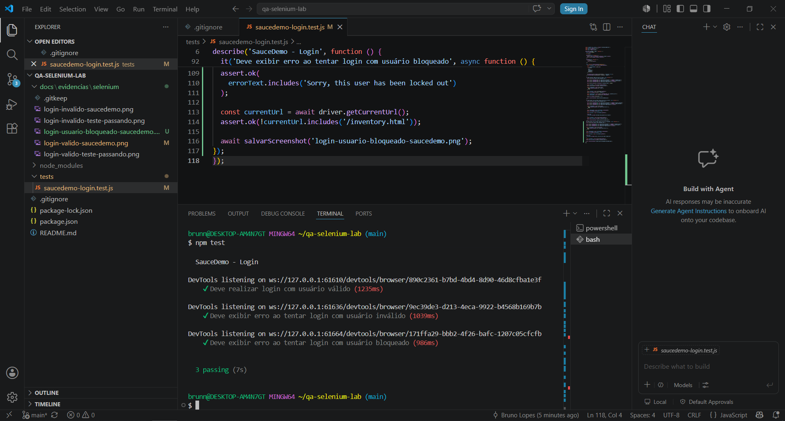

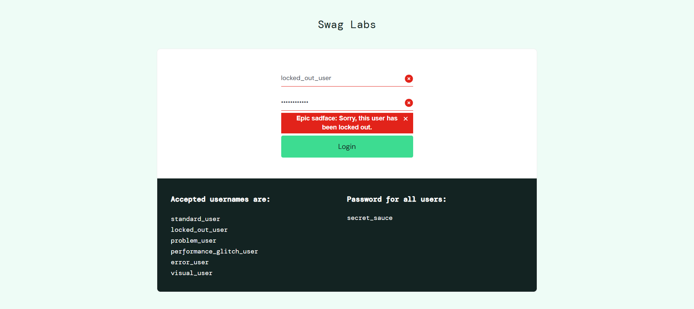

### Carrinho

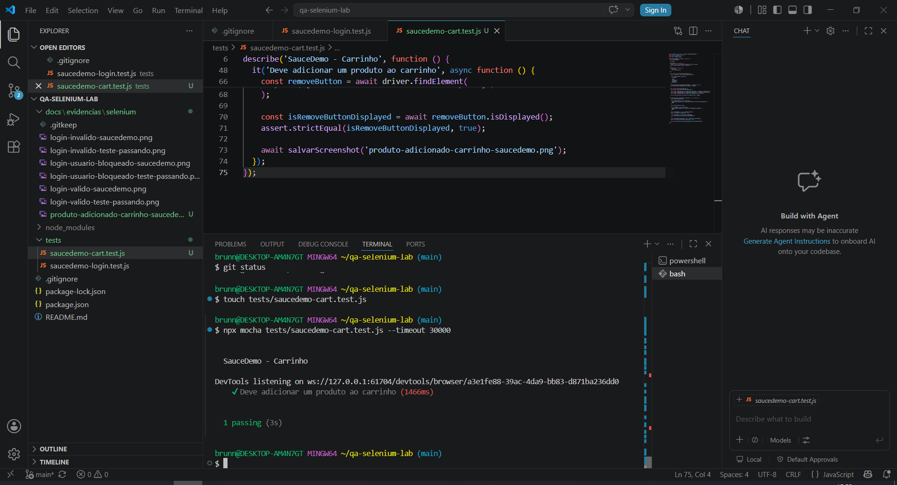

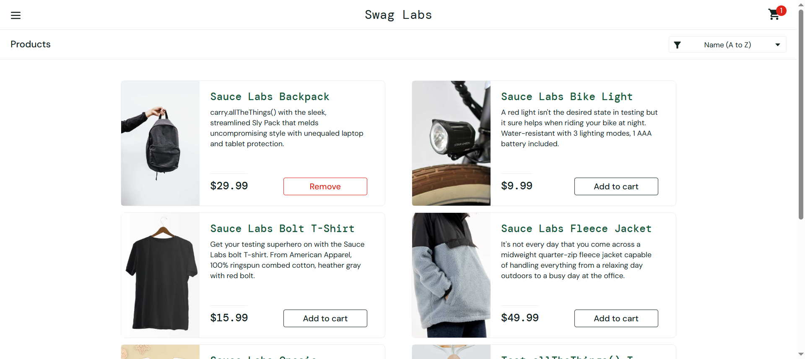

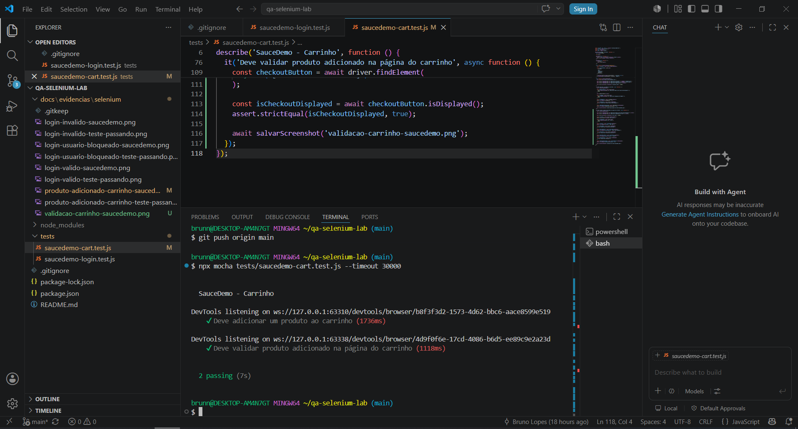

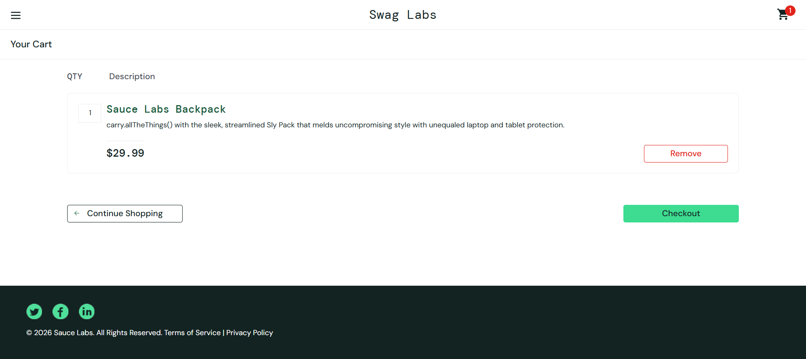

### Checkout

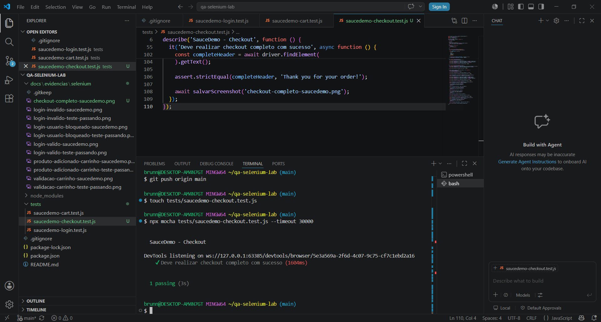

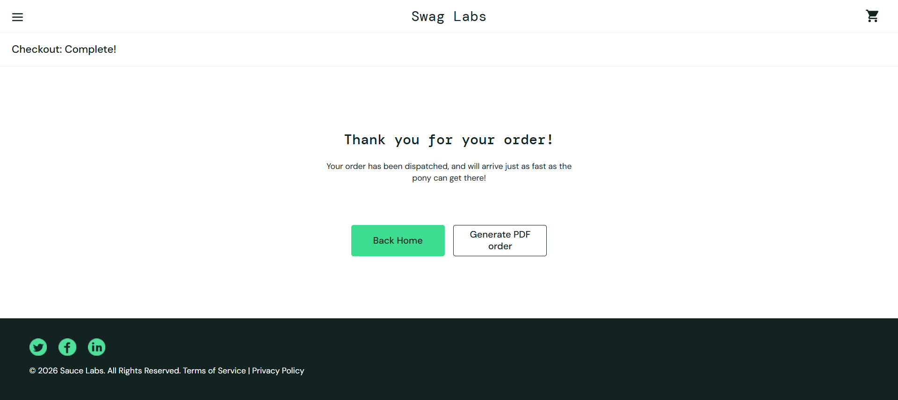

## Boas práticas aplicadas

- Separação dos testes por fluxo funcional;
- Uso de seletores estáveis com `data-test`;
- Validações de URL, textos, elementos visíveis e fluxo de navegação;
- Uso de `async/await` para controle das ações automatizadas;
- Uso de waits explícitos com `until`;
- Geração de evidências com screenshot;
- Organização das evidências em pasta específica para documentação;
- Execução da suíte completa via terminal;
- Controle de arquivos temporários com `.gitignore`.

## Observações

As evidências geradas pelos testes foram salvas na pasta:

```text
docs/evidencias/selenium
```

A pasta `node_modules` foi adicionada ao `.gitignore`, evitando versionar dependências instaladas localmente.

## Status do projeto

Concluído nesta etapa.

Suíte automatizada Selenium criada, organizada, executada e documentada com sucesso.

## Próximas melhorias possíveis

- Criar comandos auxiliares reutilizáveis;
- Aplicar Page Object Model;
- Utilizar massa de dados externa;
- Adicionar testes negativos no checkout;
- Executar testes em pipeline de CI/CD;
- Criar projeto complementar com Playwright.